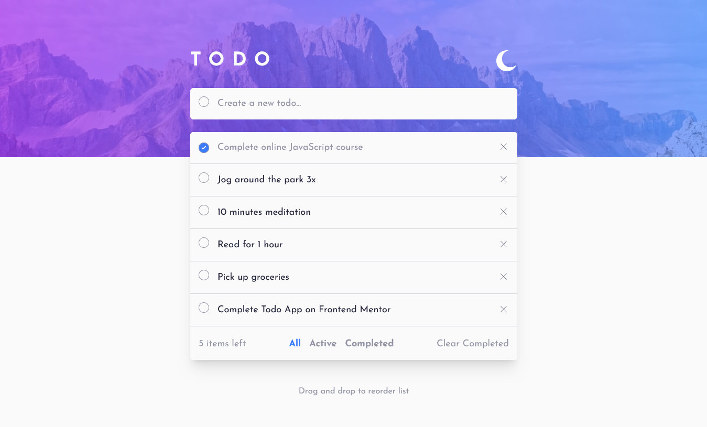

# Frontend Mentor - Todo app solution

This is a solution to the [Todo app challenge on Frontend Mentor](https://www.frontendmentor.io/challenges/todo-app-Su1_KokOW). Frontend Mentor challenges help you improve your coding skills by building realistic projects.

## Table of contents

- [Overview](#overview)
  - [The challenge](#the-challenge)
  - [Screenshot](#screenshot)
  - [Links](#links)
- [My process](#my-process)
  - [Built with](#built-with)
  - [What I learned](#what-i-learned)
  - [Useful resources](#useful-resources)
- [Author](#author)

## Overview

### The challenge

Users should be able to:

- View the optimal layout for the app depending on their device's screen size
- See hover states for all interactive elements on the page
- Add new todos to the list
- Mark todos as complete
- Delete todos from the list
- Filter by all/active/complete todos
- Clear all completed todos
- Toggle light and dark mode
- **Bonus**: Drag and drop to reorder items on the list

### Screenshot

### Links

- Solution URL: [https://www.frontendmentor.io/solutions/todo-app-with-nextjs-react-dnd-and-postgresjs-r8nKydrOMb](https://www.frontendmentor.io/solutions/todo-app-with-nextjs-react-dnd-and-postgresjs-r8nKydrOMb)
- Live Site URL: [https://todo-app-main-alfi.vercel.app/](https://todo-app-main-alfi.vercel.app)

## My process

### Built with

- [Next.js](https://nextjs.org/) - React framework using App Router, Server Components, and Server Actions.
- [React 19](https://reactjs.org/) - UI library for building interactive components.
- [TypeScript](https://www.typescriptlang.org/) - Static typing for better code quality.
- [Tailwind CSS](https://tailwindcss.com) - Utility-first CSS framework for responsive design.
- [next-themes](https://github.com/pacocoursey/next-themes) - Light and dark mode theme management.
- [PostgreSQL](https://www.postgresql.org/) - Database for persistent todo data.
- [Postgres.js](https://github.com/porsager/postgres) - PostgreSQL client used in Server Actions.
- [React DnD](https://react-dnd.github.io/react-dnd/about) - Drag-and-drop functionality.
- [dnd-multi-backend](https://github.com/LouisBrunner/dnd-multi-backend) - Desktop and mobile drag-and-drop support.
- [Zod](https://zod.dev/) - Schema validation for type-safe data.
- Mobile-first workflow - Design optimized starting from mobile screens.

### What I learned

This project was my first hands-on experience using **Next.js**, which required a significant shift in mindset compared to traditional React applications. Through this challenge, I learned how to:

- Understand core **Next.js App Router** concepts, including the distinction between **Server Components and Client Components** and when each should be used.
- Use **Next.js Server Actions** to handle data mutations and communicate directly with a PostgreSQL database without relying on a traditional REST API layer.
- Manage application state and UI behavior in a framework that blends frontend and backend logic.

This was also my first time implementing **drag-and-drop functionality** using **React DnD**:

- Learned how to integrate `react-dnd` with `dnd-multi-backend` to support both **desktop (HTML5)** and **mobile (touch)** interactions.
- Gained experience handling more complex UI behavior such as reordering list items while keeping the UI and database state in sync.

Overall, this project helped me become more comfortable learning new technologies, reading official documentation, and solving unfamiliar technical problems in a real-world scenario.

### Useful resources

- [Next.js Documentation](https://nextjs.org/docs) - Documentation for App Router, Server Components, and Server Actions.
- [React DnD Documentation](https://react-dnd.github.io/react-dnd/about) - Guide for implementing drag-and-drop interactions in React.
- [next-themes Documentation](https://github.com/pacocoursey/next-themes) - Documentation for theme switching in Next.js.
- [Tailwind CSS Documentation](https://tailwindcss.com/docs) - Documentation for using tailwind css.
- [Zod Documentation](https://zod.dev/) - Documentation of using zod to validate data and type-safe data handling.
- [Next.js Project Structure](https://medium.com/@burpdeepak96/the-battle-tested-nextjs-project-structure-i-use-in-2025-f84c4eb5f426) - An article that explains best practices for structuring a Next.js project.

## Author

- Website - [Muhammad Alfi Zain](https://muhammad-alfi-zain.vercel.app/)
- Frontend Mentor - [@AlfiZain](https://www.frontendmentor.io/profile/AlfiZain)
